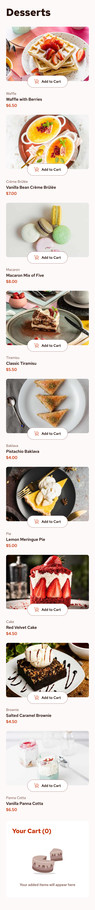
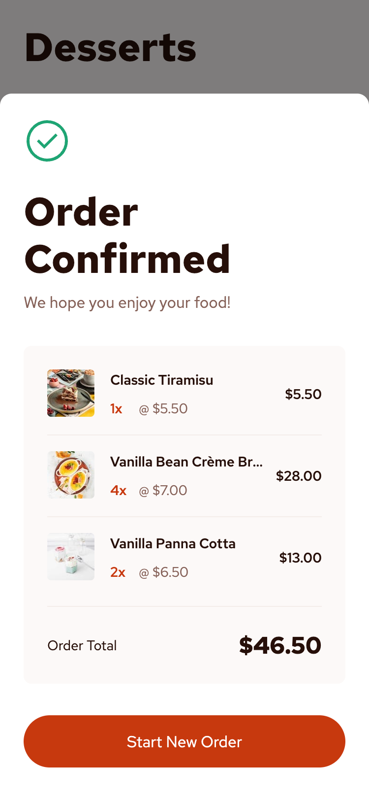

# Frontend Mentor - Product list with cart solution

This is a solution to the [Product list with cart challenge on Frontend Mentor](https://www.frontendmentor.io/challenges/product-list-with-cart-5MmqLVAp_d). Frontend Mentor challenges help you improve your coding skills by building realistic projects.

I completed this challenge as part of the [JavaScript frameworks and libraries](https://www.frontendmentor.io/learning-paths/javascript-frameworks-and-libraries-JDWoqQjMyb) Frontend Mentor learning path. This continues my efforts to learn my chosen JS Framework - [Vue.js](https://vuejs.org/) -- and now adding on more sophisticated state management using [Pinia](https://pinia.vuejs.org/).

## Table of contents

- [Overview](#overview)
  - [The challenge](#the-challenge)
  - [Screenshots](#screenshots)
  - [Links](#links)
- [My process](#my-process)
  - [Built with](#built-with)
  - [What I learned](#what-i-learned)
  - [Continued development](#continued-development)
  - [Useful resources](#useful-resources)
- [Author](#author)

## Overview

### The challenge

Users should be able to:

- Add items to the cart and remove them
- Increase/decrease the number of items in the cart
- See an order confirmation modal when they click "Confirm Order"
- Reset their selections when they click "Start New Order"
- View the optimal layout for the interface depending on their device's screen size
- See hover and focus states for all interactive elements on the page

### Screenshots

|               Mobile designed at 375px:                |               Tablet designed at 1440px:               | Desktop designed at 1440px:                             |
| :----------------------------------------------------: | :----------------------------------------------------: | ------------------------------------------------------- |
|          |          |          |
|  |  |  |
|   |   |   |

### Links

- Solution URL: [https://github.com/elisilk/product-list-with-cart](https://github.com/elisilk/product-list-with-cart)
- Live Site URL: [https://elisilk.github.io/product-list-with-cart/](https://elisilk.github.io/product-list-with-cart/)

## My process

### Built with

- Semantic HTML5 markup
- CSS custom properties
- Flexbox
- CSS Grid
- Mobile-first workflow
- Accessibility
- [Vue](https://vuejs.org/)
- [Pinia](https://pinia.vuejs.org/)
- [Vite](https://vite.dev/)

### What I learned

As always, so many cool :sunglasses: things. Here are some of the key resources I used:

- Basic Vue single page application setup on my local machine
  - [Creating a Vue Application](https://vuejs.org/guide/quick-start.html#creating-a-vue-application)
  - [`create-vue`](https://github.com/vuejs/create-vue)
- Deployment setup
  - [Vite Deploying a Static Site](https://vite.dev/guide/static-deploy.html)
- [Better Way to create Modals on Vue JS with Dialog HTML Element](https://www.youtube.com/watch?v=ZNFSQtqwNX4&ab_channel=TonyXhepa) - Loved this video. Helped me understand much more about [Vue Template Refs](https://vuejs.org/guide/essentials/template-refs), and specifically how to make use of them to use the built-in [HTML `dialog` element](https://developer.mozilla.org/en-US/docs/Web/HTML/Reference/Elements/dialog).
- I still struggle with colors and feel there is still a lot to learn there. But I especially want to better understand what is the resulting color when two colors are layered on top of one another when the top layer has some level of opacity.
  - [https://stackoverflow.com/questions/50574524/color-of-stacked-semi-transparent-boxes-depends-on-order](https://stackoverflow.com/questions/50574524/color-of-stacked-semi-transparent-boxes-depends-on-order)
  - [Alpha compositing](https://en.wikipedia.org/wiki/Alpha_compositing)
  - [How to determine the equivalent opaque RGB color for a given partially transparent RGB color against a white background](https://graphicdesign.stackexchange.com/questions/113007/how-to-determine-the-equivalent-opaque-rgb-color-for-a-given-partially-transpare)
- [`text-overflow`](https://developer.mozilla.org/en-US/docs/Web/CSS/text-overflow) - A neat little CSS property to display an ellipsis when text content overflows its container.
- [Auto-Sizing Columns in CSS Grid: `auto-fill` vs `auto-fit`](https://css-tricks.com/auto-sizing-columns-css-grid-auto-fill-vs-auto-fit/)
- [Every Layout - The Sidebar](https://every-layout.dev/layouts/sidebar/)
- Images
  - [`picture`](https://developer.mozilla.org/en-US/docs/Web/HTML/Reference/Elements/picture)
  - [`source`](https://developer.mozilla.org/en-US/docs/Web/HTML/Reference/Elements/source)
- All kinds of [Vue](https://vuejs.org/) stuff
  - [Vue Conditional Rendering](https://vuejs.org/guide/essentials/conditional)
  - [Vue Class and Style Bindings](https://vuejs.org/guide/essentials/class-and-style.html)
  - [Vue Computed Properties](https://vuejs.org/guide/essentials/computed)
  - [Vue Props](https://vuejs.org/guide/components/props)
  - [Vue Event Handling](https://vuejs.org/guide/essentials/event-handling)
  - [Vue List Rendering](https://vuejs.org/guide/essentials/list)
  - [Vue State Management](https://vuejs.org/guide/scaling-up/state-management.html)
- Vue Examples / Playground
  - [Sharing State Across Components (without Pinia)](https://play.vuejs.org/#eNrNkjFPwzAQhf/KyQsgUIIEU1UQDQIJBkDA6KW4R3Gb2JF9KZWq/HfOdpsWSmFgYYp993zve6csxKCus1mDoif6XjldE3ikpj6XRle1dQSXlr8GDQ3g1dkK9rJ8XQpP97alxba0WEr7ebJhA74QVnU5JOQbQH/DKv9SKWKln3cPxJH4jLE7wQI8WYfQdlTxnk38LzwjPYsHPr40RNbAhSq1mp5JkSZooxxWTLB/IMVSCnAdXAY9WCyNM2UbQ9C2y1l5GpY88mSyI1nc2j9LVvwl2YqPM3UZHA4V6dk6RvpTpMF5VChrPEePSc869f4iuESAHhwfhcsGNMQuAL1pnygPD0OFSdsD5iDPU1/1mFGsYZgol0Lx4nWJ7r4mza5ScNY0SIphWdr321gj12B0jG/eUE2/qU/8PNSkeHDo0c1Qiq5HQzdGSu2rpzuc87lrVnbUlKz+ofmI3pZNYEyyojEjxt7QRdqbuGJtxs/+ak5o/CpUAI3riHopeOPhn9sVfY17kp2u1ijaD8rpbks=)
  - [Simplet ToDo List App](https://play.vuejs.org/#eNp9VF1v2jAU/StWNClBpYm67gmlVbuNSZ20rup4a/aQxhdwcezIH8CE+O+7tjFJO9YXcO65H+f43utdctt1+dpCMklK3SjWGaLB2O66EqztpDJkRxTMyZ7MlWxJiq7pEZpJKu8MtAcsL6LBZUQ3QirRSKENEbBx2Ay2hly5hFmajiJoENEH85OL2rkfQhidkItxOBtmOExI+lUSswRCmV6C9iX23mMQ8vFNyKxeAZEW62CgUbVeno67fBP3Q258CK83IkRU4jeSrgQHp2hrvFyKzD8569yKxjApSE3pfdCbjUIBrzBf19xC3lm9zAZl+0RnZ68ZDC4txHoSyID8CyGJFEkixbIIfcQO4gc2o+O1AfdlyrlULVmfSzHR9rllJu8UrEGYqyrpSVcJOjsaJa+fgRMMQhwrnjsZiN5SSmqvqSy8S/RnorMmnAmWaSUFHkIj2SqJMKOvkkYzkm1gKTkFV3SaL3LyDYD6RjT1Mb6IJZ+tMVI4SmVxODukLJzUcLRHfq7UOcMr6TkGcZlDxoQJCtsR/oWG9awmK/iDbs6aMzqw+05FxH/04I2CVq4jqnPdcdZA5ouMycUoel6XxZHYgbynjObYvGScDFfrxLJSmDMBD0p2OntKPZPUDWuwT7HXzh4YeeC/Y+L6zg43ttuFWSR7HKzBfZObBrWsUNoHwNRZTIyarh/98U03fMbXgozG7Z+zRf6ipUBFfiWqpJFtxzion53bJezBJO4ozijncvPd24yycNgWjFlCszphf9FbZ6uSBwUa1Bqbc8RMrRaA8+Tg6a97P5tHECfXula+Az6Cltw6jsHtsxUUaQ/8PNs7/1IysZjp6daA0FGUI9o/Q1WCbf3yjvSe7mWOr41/jPbJ/i+QKuHA)
- All kinds of [Pinia](https://pinia.vuejs.org/) stuff
  - [Defining a Store](https://pinia.vuejs.org/core-concepts/)
  - [State](https://pinia.vuejs.org/core-concepts/state.html)
    - [Resetting the state](https://pinia.vuejs.org/core-concepts/state.html#Resetting-the-state)
    - [Subscribing to the state](https://pinia.vuejs.org/core-concepts/state.html#Subscribing-to-the-state)
  - [Getters](https://pinia.vuejs.org/core-concepts/getters.html)
  - Pinia Playground (examples)
    - [To Do List](https://play.pinia.vuejs.org/#eNqtVs1y2zYQfpU1L5QdmUzGbQ4cyWO3k86kh7STuKcwB4pcWohJgIMfWRqVb9IH6HP1SboA+Cu7nkzbiygQu99++Haxy2Nw2zTRzmCQBCuVS9ZoUKhNc51yVjdCajiCxBJaKKWoISTTcLKltJB4Jz5iqQaThnGWTY2MIpNCjBZRrO06+qrILOW54EqDe/XJ4sF6cFmc99tHKFmlUS67JxY95nrKYjHCkGvvzPHRWt/hXpM5nWcRhm67NDzXTHDICoe3OIdjygFYCYuziVe0yyqD3SYQgjaS3AFaiwIT8lGP9NTbGj55S3xCUoFwVrFPAElPC411U2UaaQWwqrINVtcrxhujYXdZiwKrdRp4KdIA9KFBWsusYIKWDpnWWVWlwTXcVtUq9hD/Ba2kxKotFhbyp+7//4Fr+BT5t2E1w95K/zR+baMxilEKSQhWfmB8XhoUIXnAQ7cdMYvuXcn5lKM3Uf2xRrL5FvOHjdhPnI9Hl+9I23JqKXMOMa6YZxh3FDs5/PYHfATLKumsT+NP6mKMbQPQ6oZO0UhUKkJOx7N59TXWcZrptDFaUz0nBVPZpsKCrKeFbOHyiuUPM5TbgsT2noSyiofiC5aBv8aXddbQfRWcGoW7BGm3QTIn/bVIA3f37Zs0iN3/CFV9uZHiUaEk/zRY9qY31EriAndaiEpdZg3zblutG5XEcV5wsidx2E5GHHXMmzp+4nPzNvo+ekPSb2IKFDNe4H4ehjwuC6y/Bb03vXkdvfkueutQd1cdaG1RuxvfkixaUWsp2f2JKLmoG1ah/KWxbWUuDt1G8fize6elwYGiK7Fn3n9VVHWW9a+UfJQ7nBxLZ/IeKZt2+92nDy6zwyYVlanI+oXNj6hEZSxHb/aD4QXRntg5tu9djhm/v1Pv9hq56g9liTo1nL2T+ccXjj7SvYqupip2c4AEHMZFgdQA0E+C05mSctw7M9/Xh8mynnotQgcbLn18pamSE6DWvr6GRUcpvriAG3vN3G0mhRKyk3TQJbAiAW7qjZ01Y0dIYENFhxmH9vOXFi5ij+MiJfD5S6fbBDckBUP4HcK+n7nF2OzCEcX3rQScS48UuzYAj6yqYIOQGS3qTLOcbA7U7EqU1OmIQEfWe5E++j2Rfe1Q2nP3IOkJnmh2h+8Z+BHr9BlGmwtsY9lKrtCm8gz++uPPftePPi9q5NPn2S/c6HUinzRTN/j6UgEYFXg+/rdEOHs5BGWhQ6NseDz17xLdw8wS9U/M7VeD3rKeL6zXNNyHdE8Mncg2kSD0lgy7BFGu9fZE/Kn2gzZdkImKvUkLWCl8nsmk9GZcpqAnyRlgT5LjbF1upsL738x9UY3VZuuJHyCrheEaRAnUC0xNo0wte7gMGrrmjIgLCVxo79h/SdmszevzIAzJx6FgEnNN16E2NhVEC33d9LYjz6gxarvwJeBT7/b8fXn1al4BZWZFbGdVZX/b86D9GztAvyY=)
    - [Basic Counter](https://play.pinia.vuejs.org/#eNqNU8Fu2zAM/RXBl6RoIrXI0AFBUmQbeugO27Du6ItjM6lSiRIk2TUQ+N9HS4nrdkPRm0Q+vvdIicfsi7W8qSFbZitfOmkD8xBqy1SB+3WeBZ9ntzlKbY0L7MhqDw/BOGAd2zmj2YSL0tQYwPHgJznmWBr0RBJB6wE/vchxJZIC8dElgLaqCEA3xlbbOgSDbFMqWT6RbqzneHlJ8vdYOtCApH9MxBxZ161EKiKClRixZbMs2Z3rwvKDN0jNHXuV/JSgnpYsRvqYlSiLPpJnIp45eD3fOvPsqasDgWdn6IYmJSpogjHKzwsrU9ljCNYvhSgrJHwFSjaOIwSBVot/ajY3/IZfCyW3goSExAra1zJUMa9Af4T9DN1c8etP/HNkbRYnUt2z9qRdjh2NJXh6nJ3cvxlKabSVCtxPGyQ93qvhFEqZ5+8xFlwNg8XyEcqn/8QPvk2ufzmg8TUwaisUbg8hpe8efkBL5yGpTVUrQr+T/A3eqLr3mGBfa6zI9ggX3d7HN5a4/+Pv2gDoz031RuM0Ij6O+ds7rb/YXfDFaIov/51GOCxGBTuJb3Yj/iZaigHkYDckST3uC7QxmdZmWK/1mHA6OWlOZmx6wda3yWQqQcIS7/SKNqyPOlpfhyRGO0KGKZp1fwEqtlBG)
- [Vuex](https://vuex.vuejs.org/) - Although Vuex is no longer the official state management library for Vue (it's now Pinia), I appreciated this site, especially for it's examples
  - [Vuex Examples](https://github.com/vuejs/vuex/tree/main/examples/composition)
    - [Shopping Cart](https://github.com/vuejs/vuex/tree/main/examples/composition/shopping-cart)
  - [Application Structure](https://vuex.vuejs.org/guide/structure.html)

### Continued development

Specific areas that the solution should be improved (known issues):

- [x] Add thumbnail images of each item to the order confirmation dialog
- [x] Gutter spacing and positioning for the order confirmation dialog in the different viewport sizes
- [x] Block spacing for header section of the order confirmation dialog
- [x] Fix so that dialog does not go away without clicking the "Start New Order" button so that the state properly resets, maybe use the [`dialog`'s `closedby` attribute](https://developer.mozilla.org/en-US/docs/Web/HTML/Reference/Elements/dialog#closedby)?

More general ideas I want to consider:

Hmm 🤔 ...

- What D-R-Y improvements can I make? Seems like there is repetition across the individual items in the cart and in the order confirmation dialog, so can those be made into a component that could be reused for both? What other aspects should be made into their own component?

### Useful resources

- [Vue Guide](https://vuejs.org/guide/)
- [Pinia Guide](https://pinia.vuejs.org/core-concepts/)
- [Vite Guide](https://vite.dev/guide/)
- [MDN Web Docs for CSS](https://developer.mozilla.org/en-US/docs/Web/CSS) - Went here a lot to reference the different CSS properties and the shorthands, and all the great explanations about best practices.

## Author

- Website - [Eli Silk](https://github.com/elisilk)
- Frontend Mentor - [@elisilk](https://www.frontendmentor.io/profile/elisilk)
